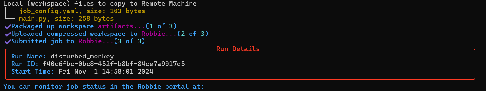

# Examples
This repo contains a collection of PyTorch examples adapted for usage on the Robbie platform.

Prerequisites
- Python 3.9 or greater
- pip

For support, email: support@robbie.run

[Setup](#setup)  
[Run Your First Job](#run-your-first-job)  
[Command Runner](#command-runner)  
[Images](#images)

## Setup

### Step 1. Sign Up for Robbie
Visit https://robbie.run/portal/signup and sign up with your email address or Google. 

Check your email for a message from Robbie and click Verify Your Account in the email.

### Step 2. Download Robbie Examples to your local machine
[https://github.com/Positron-Networks/robbie-examples](https://github.com/Positron-Networks/robbie-examples)

### Step 3. Create and activate a Python virtual environment
Navigate to a directory where you would like the environment to live and create a virtual environment. 
This should NOT be the location that your codebase lives to avoid unnecessarily uploading virtual environment files to the Robbie Job Runner.
```sh
python -m venv venv
```

Activate the `venv` environment.  

*macOS/Linux*
```sh
source ./venv/bin/activate
```
*Windows PowerShell*
```sh
.\venv\Scripts\Activate.ps1
```
*Windows Command Prompt*
```sh
.\venv\Scripts\activate.bat
```

### Step 4. Install the Robbie Python package and log in
```sh
pip install robbie
```

The following command will pop up a web browser and ask you to log in.
```sh
robbie login
```

After completing login in your browser, you should see `Authenticated!` printed to your console output. 

## Run Your First Job
macOS/Linux
```sh
cd getting_started/command_runner && robbie run
```

Windows
```shell
cd .\getting_started\command_runner
```
then
```shell
robbie run
```

Hit enter to confirm the job settings. You should see the Run Details printed to your console.


Take note of the job name (e.g. `disturbed_monkey`) then go to the [Robbie Portal](https://robbie.run/portal/app/my-runs) in your browser to monitor the job.

You can also run with `--tail` to see realtime job logs in your console.

```sh
robbie run --tail
```

See all available CLI options with 
```shell
 robbie run --help
```

### Congratulations - you have run your first job!
Try other examples by navigating into each directory within [command_runner](./command_runner) and executing
```sh
robbie run
```

## Command Runner
In each [command_runner](./command_runner) example directory, there is a `job_config.yaml` file that contains the parameters to run your job. The `python_job` 
object must be defined, and it must contain the `commands` parameter. The `commands` can be any valid commands that you can 
execute from within the same directory as the yaml file.

**Minimal `job_config.yaml`**
```yaml
version: 1.0
python_job:
  commands:
    - python main.py
```
**`job_config.yaml` with Multiple Commands**
```yaml
version: 1.0
python_job:
  commands:
    - pip install -r requirements.txt
    - python main.py
```

### Optional Parameters  
- `name` Job name that appears in the Portal 
- `funding_group_id` If you want to use a Funding Group other than your Personal Funding Group, set the id here. Check [My Resources](https://robbie.run/portal/app/my-resources) in the Robbie Portal to see if you have access to Funding Groups. The Funding Group id will be displayed when you select one on this page.
- `environment_id` If you want to use an environment other than the default, set the id here. View [My Resources](https://robbie.run/portal/app/my-resources) and expand the environment to see the id.
- `image` The [Image](#images) to use for job execution
- `max_tokens` Maximum number of tokens to use for the job
- `max_time` Maximum time to allot for job execution, in hh:mm. For example, `0:30` is 30 minutes.
- `workspace_dir` Directory on your machine containing the files you want to be uploaded when Robbie prepares your job.

**Example `job_config.yaml` with Optional Parameters**  
Note: These values are for example purposes only.
```yaml
version: 1.0
python_job:
  name: Sample Job
  funding_group_id: 95127aac-186b-4076-8c5b-ab1n3n34321
  environment_id: 936d7c78-f2da-4c8d-b769-b3bbb8b4b2b4
  image: robbie:1.0.0-gpu-py3.12-torch2.5-ubuntu22.04
  max_tokens: 5
  max_time: 0:30
  workspace_dir: ~/robbie-workspace
  commands:
    - pip install -r requirements.txt
    - python main.py
```

### `robbie run` Options
Options that you set in the `robbie run` command override those that may be set in the `job_config.yaml`. View the available options by executing
```shell
robbie run --help
```

## Images
| Python Version | PyTorch Version | CPU/GPU | Image                                             |
|----------------|-----------------|---------|---------------------------------------------------|
| 3.9            | 2.0             | GPU     | robbie:1.0.0-gpu-py3.9-torch2.0-ubuntu22.04-beta  |
| 3.10           | 2.2             | GPU     | robbie:1.0.0-gpu-py3.10-torch2.2-ubuntu22.04-beta |
| 3.11           | 2.4             | GPU     | robbie:1.0.0-gpu-py3.11-torch2.4-ubuntu22.04-beta |
| 3.12           | 2.5             | GPU     | robbie:1.0.0-gpu-py3.12-torch2.5-ubuntu22.04-beta |
| 3.9            | 1.13            | CPU     | robbie:1.0.0-cpu-py3.9-torch1.13-ubuntu22.04-beta |
| 3.10           | 2.2             | CPU     | robbie:1.0.0-cpu-py3.10-torch2.2-ubuntu22.04-beta |
| 3.11           | 2.4             | CPU     | robbie:1.0.0-cpu-py3.11-torch2.4-ubuntu22.04-beta |
| 3.12           | 2.5             | CPU     | robbie:1.0.0-cpu-py3.12-torch2.5-ubuntu22.04-beta |