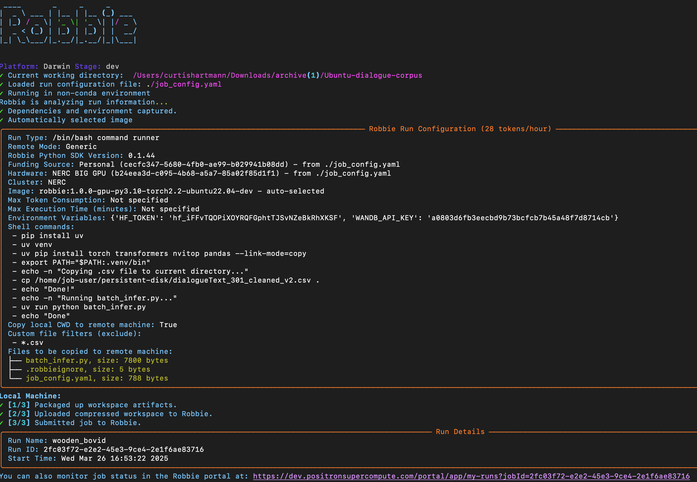

# LLM (Llama3) batch Inference example on a GPU

## The Basics
Batch inference to determine topic and sentiment from time-stamped chat conversations

- Chat conversations - https://www.kaggle.com/datasets/rtatman/ubuntu-dialogue-corpus
- Prompts - https://developers.endeavorcx.com/docs/topic-level-sentiment-analysis (Thanks Chris Crosby)
    - Role-based prompts - system (with few shot examples) and user prompts
- Model: meta-llama/Llama-3.1-8B-Instruct - max_tokens=2048
- GPU: 2 Nvidia A100 40G 

## Files in the repo
- `job_config.yaml` - Robbie job configuration 
    - Need to set your huggingface token to pull the model
- `batch_infer.py` - Python script that uses the `vllm` inference framework
    Here are the arguments/options you can pass in the command line (job_config.yaml)
    `--rows <value>` - The number of rows to read from the .csv 
    `--chunk <value>` - How many rows to process at a time throug the LLM
    `--debug` - turns on debug output
- `dialogeText301_cleaned_v2.csv` - cleaned .csv of chat conversations (1.39G) - download from: s3://robbie-examples/dialogueText_301_cleaned_v2.csv
    Wrangled with Pandas:
    - Removed unwanted columns
    - Renamed columns to be consistent with prompt (Timestamp, Speaker Label, Utterance)
    - Removed rows with empty values
    - Went from 1.93G to 1.39G
- `infer_results.json` - json file created from the inference results

## What the job (job_config.yaml) does on the remote machine
- Installs a bunch of dependencies (vllm)
- Copies the transcript examples in `dialogeText301_cleaned_v2.csv` from the pd to local disk
- Note: `dialogeText301_cleaned_v2.csv` needs to be uploaded to the Robbie persistent disk (pd) using the following command:
```sh
% robbie pd cp ./dialogeText301_cleaned_v2.csv pd://
```
- runs the python script `batch_infer.py`

## batch_infer.py logic
- Loads the cleaned .csv
- System and user prompts in the code
- Submits batch chucks for inference
- Writes results to .json file

##Running the inference job on Robbie

```bash
cd <directory>
% pip install robbie
% robbie login
% robbie run --tail --y --v
```

## Observations during the run
- Kicking off the run

- Batch inference output - each batch of 75 takes about 

- Two A100 GPUs during the run